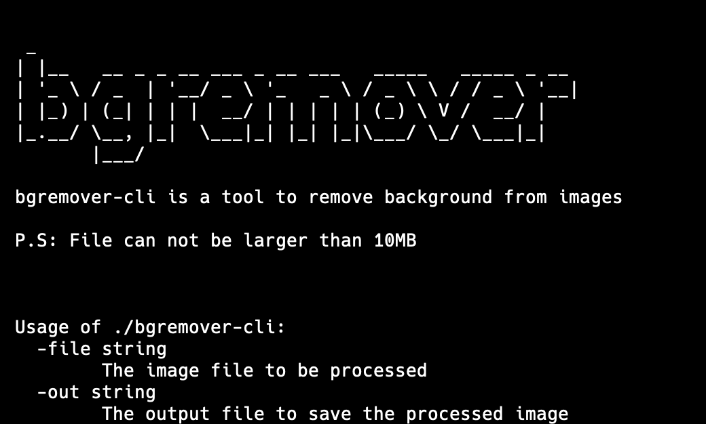
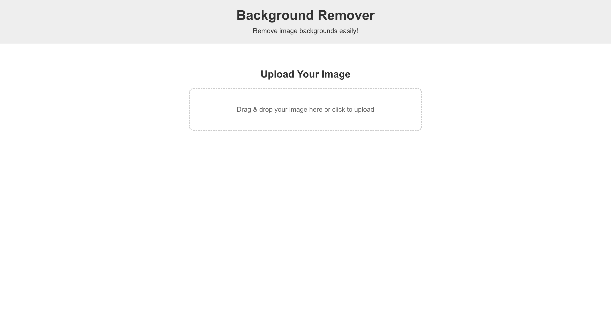
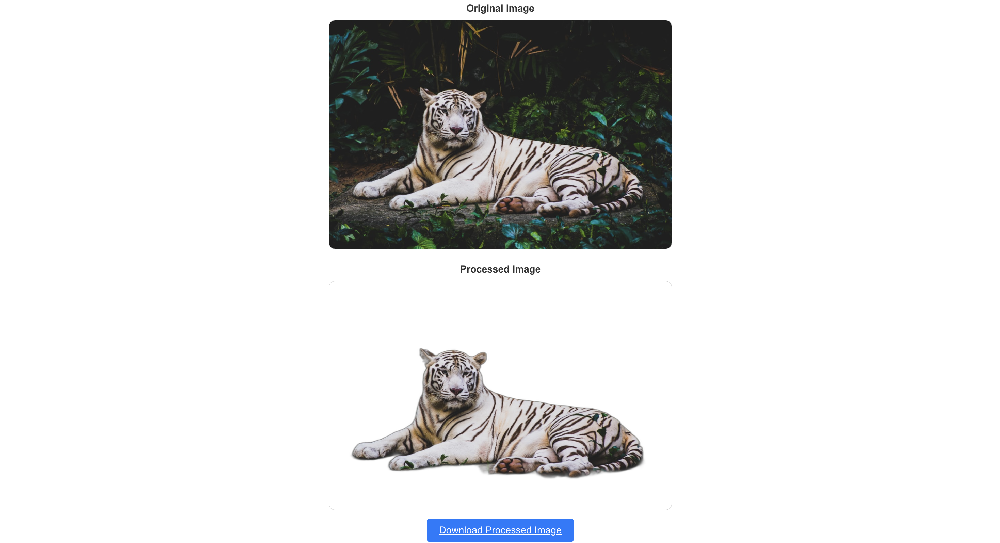

## bgremover

This is background remover service which is available as command-line tool and http server.

### Command-line Tool


#### Installation

You can find [releases](https://github.com/root27/bgremover/releases) or if you are using Macos and homebrew, you can use the command below to install and use.

```code

brew install root27/tools/bgremover-cli

```

#### Usage




```code

./bgremover-cli -file=<Path-to-input-image> -out=<Specified-filename-to-save>(OPTIONAL)

```

You do not have to specify the output file. You can see usage of cli tool using command below;

```code

./bgremover-cli -h

```

If you encounter the problems while executing the binary, you can change permission of the file using;

```code

chmod +x bgremover-cli

```

### Web Service

You can use [web service](https://bgremover.root27.dev) instead command-line tool.



You can see the example of web application usage below;



In the web app, the processed image can be previewed and directly it can be downloaded.


